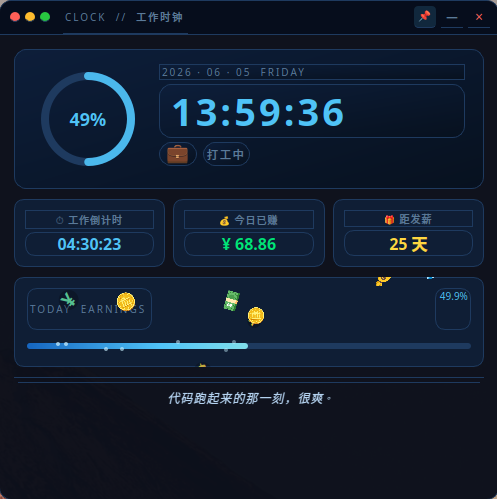
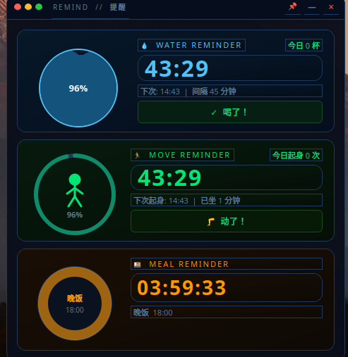
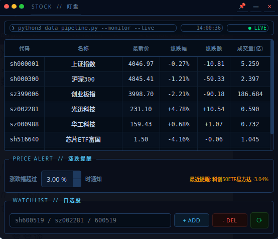
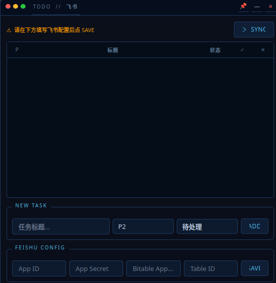
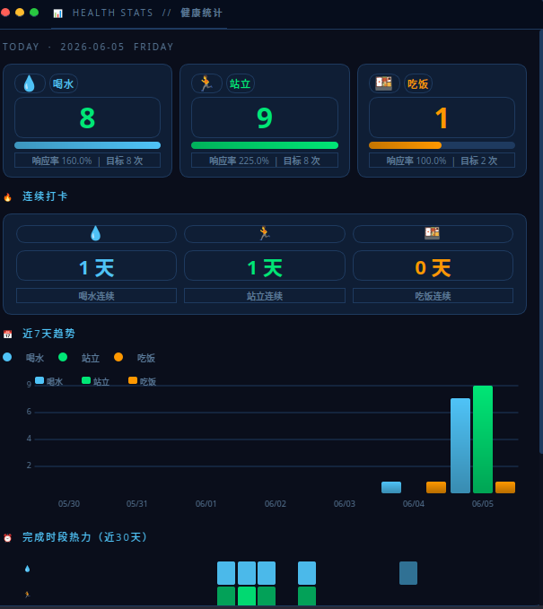

# Work Assistant

上班族桌面效率小工具，深色科技风 UI，常驻系统托盘。

## 功能一览

| 窗口 | 功能 |
|------|------|
| ⏰ CLOCK | 上下班时钟 · 工作倒计时 · 今日实时工资 · 发薪倒计时 |
| 🔔 REMIND | 喝水/起身定时提醒 · 午饭/晚饭倒计时 · 系统桌面通知 |
| 📊 STOCK | A 股行情盯盘，伪装成终端/代码风格浮窗 |
| ✓ TODO | 飞书多维表格（Bitable）双向同步任务清单 |
| 📈 STATS | 健康统计：喝水/起身/吃饭完成率 · 连续打卡 · 7 日趋势 · 时段热力图（托盘菜单打开） |

## 界面预览

### ⏰ CLOCK · 工作时钟



### 🔔 REMIND · 提醒



### 📊 STOCK · 盯盘



### ✓ TODO · 飞书



### 📈 STATS · 健康统计



---

## 环境要求

| 依赖 | 版本 |
|------|------|
| Python | 3.10+ |
| PyQt6 | 6.x |
| akshare | 最新 |
| requests | 任意 |
| notify-send | Linux 桌面通知（通常已内置） |

一键安装：

```bash
pip install PyQt6 akshare requests
```

---

## 启动方式

```bash
# 方式一：直接运行
cd ~/projects/work-assistant
python3 main.py

# 方式二：用脚本（等价）
bash ~/projects/work-assistant/run.sh
```

首次启动后窗口出现在屏幕右下角，关闭按钮不退出程序，而是缩进系统托盘。

**快捷键：**

| 快捷键 | 作用 |
|--------|------|
| `Ctrl+Shift+W` | 切换窗口显示 / 隐藏 |
| 托盘图标单击 | 同上 |
| 托盘右键菜单 | 显示/隐藏 · 退出 |

---

## 初始配置

所有配置存储在 `config/settings.json`，可直接编辑，也可在 UI 界面修改后点 SAVE。

### 1. 上下班时间 & 薪资（CLOCK 标签页底部）

```json
"work": {
  "start_time": "09:00",    // 上班时间
  "end_time": "18:00",      // 下班时间
  "monthly_salary": 30000,  // 月薪（元），用于计算日薪/实时工资
  "salary_day": 30          // 每月发薪日，遇周末自动提前到周五
}
```

### 2. 喝水 & 吃饭提醒（REMIND 标签页）

```json
"reminders": {
  "water_interval_minutes": 60,  // 喝水提醒间隔（分钟）
  "lunch_time": "12:00",         // 午饭时间
  "dinner_time": "18:30"         // 晚饭时间
}
```

喝水提醒到点后点击「✓ 喝了」重置计时器；系统会通过 `notify-send` 弹出桌面通知。

### 3. A 股自选股（STOCK 标签页）

默认已添加上证指数、沪深300、创业板指。

- **添加个股：** 在底部输入框填入代码后回车
  - 上交所：`sh600519`（贵州茅台）
  - 深交所：`sz000001`（平安银行）
  - 纯数字也可以，自动判断交易所前缀
- **删除：** 选中行后点 DEL
- **刷新频率：** 交易时段每 10 秒自动刷新；非交易时段显示「非交易时段」不发请求

**隐蔽说明：** 窗口标题栏伪装成终端命令 `python3 data_pipeline.py --monitor`，行情表格使用终端配色，路人看到像在看日志。

### 4. 飞书 TODO（TODO 标签页）

需要飞书开放平台的应用凭据，在 TODO 标签页最底部的 FEISHU CONFIG 区域填入后点 SAVE：

| 字段 | 说明 | 获取方式 |
|------|------|----------|
| App ID | 飞书应用 ID | 飞书开放平台 → 我的应用 → 应用凭据 |
| App Secret | 飞书应用密钥 | 同上 |
| Bitable App Token | 多维表格应用 Token | 打开多维表格 → URL 中 `/base/` 后面那段 |
| Table ID | 表格 ID | 多维表格 → 扩展字段 → API → 复制 tableId |

**多维表格字段要求：** 表格中必须包含以下字段名（列名）：

| 字段名 | 类型 | 说明 |
|--------|------|------|
| 标题 | 文本 | 任务名称 |
| 优先级 | 单选 | P0 / P1 / P2 / P3 |
| 状态 | 单选 | 待处理 / 进行中 / 已完成 / 已取消 |
| 备注 | 文本 | 可选 |

配置完成后点「⟳ SYNC」手动拉取；之后每 5 分钟自动同步一次。

---

## 项目结构

```
work-assistant/
├── main.py                   # 主窗口：无边框 + 系统托盘 + 快捷键
├── run.sh                    # 启动脚本
├── config/
│   └── settings.json         # 所有用户配置（自动读写，勿删）
└── modules/
    ├── theme.py              # QSS 深色科技风主题 + 颜色常量
    ├── config_manager.py     # 配置文件读写工具
    ├── salary_clock.py       # CLOCK 标签页：时钟/工资/发薪
    ├── reminders.py          # REMIND 标签页：喝水/吃饭
    ├── stock_monitor.py      # STOCK 标签页：A股行情
    └── todo_feishu.py        # TODO 标签页：飞书 Bitable
```

---

## 常见问题

**Q: 启动报 `No module named 'PyQt6'`**
```bash
pip install PyQt6
```

**Q: 股票数据拉不到**
- 检查网络是否能访问 sina 财经
- 非交易时段（9:30前、11:30-13:00、15:00后及周末）不拉数据，这是正常的

**Q: 桌面通知不弹**
```bash
# 检查 notify-send 是否安装
which notify-send
# 没有的话：
sudo apt install libnotify-bin
```

**Q: 飞书同步失败**
- 确认应用已开通「多维表格」权限（`bitable:app` 读写权限）
- App Token 是 URL 里 `/base/` 后、`?` 前的那段，例如 `BMxxxxxxxxx`
- Table ID 在多维表格页面 → 右上角「···」→「API」中复制

**Q: 窗口不见了**
- 点系统托盘图标，或按 `Ctrl+Shift+W`
