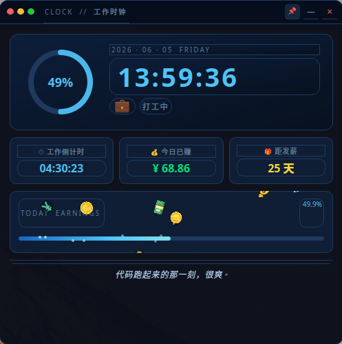
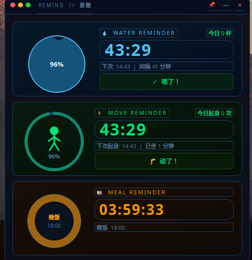
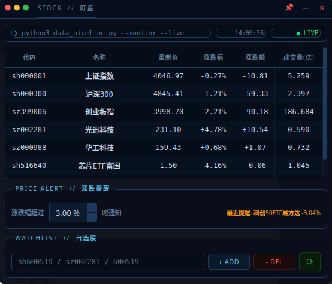
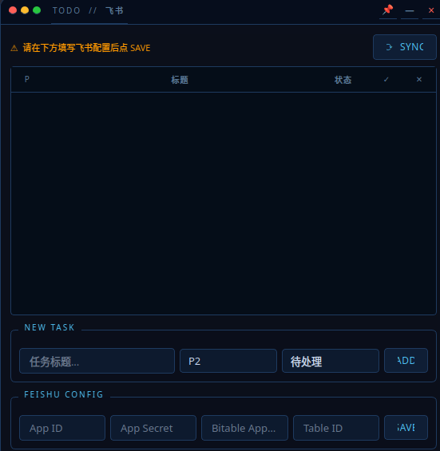
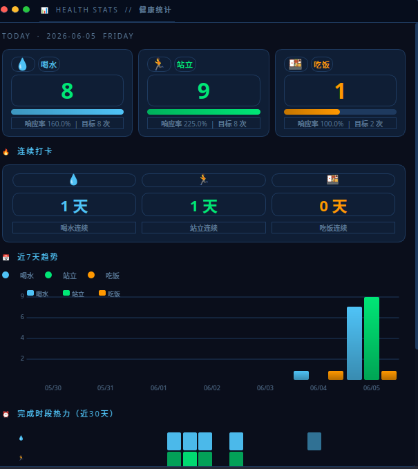
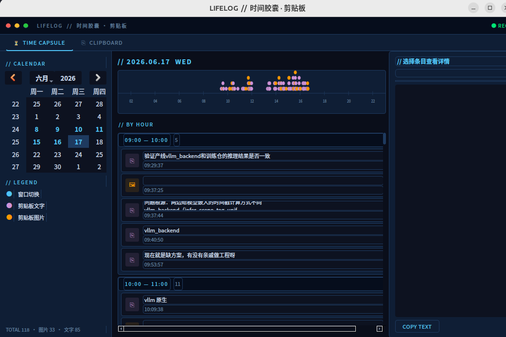

# OxHorse Tools

上班族桌面效率小工具，深色科技风 UI，常驻系统托盘。  
PyQt6 无边框多浮窗 + 系统托盘管理，Linux X11 原生运行。

## 功能一览

| 窗口 | 功能描述 |
|------|----------|
| ⏰ CLOCK | 上下班打卡 · 工作倒计时 · 今日实时工资 · 发薪倒计时 · 钱雨动画 · 励志语轮播 |
| 🔔 REMIND | 喝水/站立定时提醒 · 吃饭倒计时 · 全屏粒子爆炸弹窗 · 今日次数统计 · 打卡面板 |
| 📊 STOCK | A 股实时行情 · 涨跌提醒 · 每日收盘 AI 分析报告（含资金流 + 板块热度） |
| ✓ TODO | 飞书多维表格（Bitable）双向同步任务清单（增删改查 + 优先级 + 备注） |
| 📝 WEEKLY | 从飞书 TODO 自动生成周报草稿，支持写入飞书文档或发送给自己 |
| 📊 STATS | 健康统计弹窗：今日概览 / 7 日趋势柱状图 / 24H 热力图 / 连续打卡 / 历史总量 |
| ⏳ LIFELOG | 时间胶囊：后台记录活跃应用 + 截图 + 剪贴板；日历回溯 + 气泡时间轴 |
| ⚙️ SETTINGS | 统一设置窗口：上下班时间 / 薪资 / 提醒间隔 / 飞书配置 / 窗口尺寸管理 |

## 界面预览

### ⏰ CLOCK · 工作时钟


### 🔔 REMIND · 提醒


### 📊 STOCK · 盯盘


### ✓ TODO · 飞书


### 📈 STATS · 健康统计


### ⏳ LIFELOG · 时间胶囊


---

## 环境要求

| 依赖 | 版本 | 说明 |
|------|------|------|
| Python | 3.10+ | 类型注解使用了 3.10+ 语法 |
| PyQt6 | 6.x | GUI 框架 |
| requests | 任意 | HTTP 数据拉取 |
| xdotool | 系统包 | LifeLog 窗口监控（Linux X11） |
| notify-send | 系统包 | 桌面通知（通常已内置） |

```bash
pip install PyQt6 requests
sudo apt install xdotool libnotify-bin   # Linux
```

> `akshare` 已不再依赖，行情数据改用新浪财经 / 腾讯财经 / 东方财富接口直接拉取。

---

## 启动方式

```bash
# 直接运行
python3 main.py

# 或用启动脚本（自动 cd 到项目目录）
bash run.sh
```

首次启动后窗口出现在屏幕右下角。**关闭按钮不退出程序**，而是隐藏到系统托盘。

**快捷操作：**

| 操作 | 效果 |
|------|------|
| 托盘图标单击 | 切换所有窗口显示 / 隐藏 |
| 托盘右键菜单 | 显示/隐藏各窗口 · 设置 · 健康统计 · 时间胶囊 · 置顶控制 · 退出 |
| 标题栏 📌 按钮 | 切换单窗口置顶 |
| 拖拽边缘 | 调整窗口大小（右边缘 / 下边缘 / 右下角） |

---

## 初始配置

### 1. 上下班时间 & 薪资（settings.json 或托盘 → 设置）

```json
"work": {
  "start_time": "09:30",
  "end_time": "18:30",
  "monthly_salary": 20000,
  "salary_day": 30
}
```

薪资按法定工作日 21.75 天均摊，加班按 1.5 倍计算。发薪日遇周末自动提前到周五。

### 2. 健康提醒间隔

```json
"reminders": {
  "water_interval_minutes": 45,
  "move_interval_minutes": 45,
  "lunch_time": "12:00",
  "dinner_time": "18:30"
}
```

提醒到点后弹出全屏粒子爆炸弹窗，点击「✓ 喝了 / 动了」重置计时器，并通过 `notify-send` 推送桌面通知。  
**仅在 WORKING / OVERTIME 状态下计时**，午休 / 下班后自动暂停。

### 3. A 股自选股

默认已添加上证指数、沪深300、创业板指。

- **添加个股：** 输入框填入代码后回车（`sh600519` / `sz000001` / 纯数字自动识别交易所）
- **删除：** 选中行 → DEL 按钮
- **刷新频率：** 每 10 秒（可在设置中调整 3-60 秒）
- **涨跌提醒：** 交易时段内涨跌幅超过阈值（默认 3%）时推送桌面通知，每代码每会话提醒一次

**收盘报告（每日 16:30 自动触发，也可手动生成）：**

1. 并发拉取所有自选股近 20 日前复权日 K（腾讯财经）
2. 同步拉取今日资金流数据：主力净流入 / 超大单 / 大单 / 中单 / 小单（东方财富）
3. 拉取今日主力净流入 TOP5 板块（东方财富）
4. 构建结构化 Prompt（K 线 + 资金流 + 板块背景）
5. 调用 AI API 进行量价 + 资金分析，输出操作建议
6. 渲染 HTML 报告，保存至 `reports/report_YYYYMMDD_HHMM.html`

**窗口标题栏伪装为 `python3 data_pipeline.py --monitor --live`，防止被同事发现在盯盘。**

### 4. AI 模型配置（config/llm.json）

```json
{
  "api_key":    "your-api-key",
  "base_url":   "https://api.deepseek.com/anthropic",
  "model":      "deepseek-v4-pro",
  "max_tokens": 4096,
  "timeout":    120
}
```

支持任何兼容 Anthropic Messages API 格式的服务。优先级：**环境变量 > llm.json > 代码默认值**。

| 环境变量 | 覆盖字段 |
|----------|----------|
| `ANTHROPIC_AUTH_TOKEN` / `ANTHROPIC_API_KEY` | api_key |
| `ANTHROPIC_BASE_URL` | base_url |
| `ANTHROPIC_MODEL` | model |

### 5. 飞书 TODO

在 TODO 窗口底部 FEISHU CONFIG 区或托盘 → 设置 → 飞书 填入后保存：

| 字段 | 获取方式 |
|------|----------|
| App ID / App Secret | 飞书开放平台 → 我的应用 → 应用凭据 |
| Bitable App Token | 打开多维表格 → URL 中 `/base/` 后面那段 |
| Table ID | 多维表格 → 右上角「···」→「API」中复制 |

**多维表格字段要求：**

| 字段名 | 类型 |
|--------|------|
| 待办事项（或标题） | 文本 |
| 优先级 | 单选（P0-高优 / P1-一般 / P2-低优） |
| 是否已完成（或状态） | 复选框或单选 |
| 备注 | 文本 |

配置完成后点「⟳ SYNC」手动拉取；之后每 5 分钟自动同步一次。

### 6. 飞书周报

WEEKLY 窗口配置区填入：
- **周报文档 ID**：飞书文档 URL 中 `/docx/` 后面那段
- **自己的 open_id**：可从飞书开放平台 → 用户信息获取

点「⟳ 生成」从飞书 TODO 自动汇总已完成 / 进行中任务，生成草稿后可编辑，再「写入文档」或「发给自己」。

### 7. 时间胶囊（LifeLog）

从托盘菜单 → **时间胶囊** 打开。自动记录：

- **活跃窗口**：每 1.2 秒轮询 `xdotool`，检测标题变化时记录（应用名 + 标题 + 截图）
- **剪贴板**：监控 `QClipboard.dataChanged`，自动保存文字 / 图片（MD5 去重）

数据存储在 `~/.local/share/lifelog/lifelog.db`，截图和剪贴板图片分别存入 `screenshots/` 和 `clipboard_images/`。  
日历视图高亮有记录的日期，点击日期在时间轴 + 按小时折叠列表中查看，支持文字/图片内容预览和放大。

从托盘菜单 → **暂停记录** 可临时停止，不影响数据库已有内容。

---

## 项目结构

```
Oxhorse-tools/
├── main.py                    # 主入口：无边框多浮窗 + 系统托盘 + 位置记忆
├── run.sh                     # 启动脚本（自动 cd）
├── config/                    # 本地运行时数据（不纳入 git）
│   ├── settings.json          # 用户配置（工作 / 提醒 / 行情 / 飞书）
│   ├── llm.json               # AI 模型配置（api_key / base_url / model）
│   ├── session.json           # 当日打卡状态（跨重启恢复）
│   ├── window_positions.json  # 各窗口位置 + 尺寸记忆
│   └── health.db              # SQLite：健康行为记录
├── assets/imgs/               # 界面截图（README 用）
├── reports/                   # 每日收盘报告 HTML（自动生成，不纳入 git）
└── modules/
    ├── theme.py               # QSS 深色科技风主题 + NEON_COLORS 颜色常量
    ├── config_manager.py      # 配置文件读写（dot-path key / get_llm()）
    ├── salary_clock.py        # CLOCK：时钟 / 工资 / 发薪 / 钱雨 / 励志语
    ├── work_session.py        # 工作状态机（BEFORE→WORKING→LUNCH→OVERTIME→OFF）
    ├── punch_panel.py         # 打卡大按钮面板（光晕粒子动效）
    ├── reminders.py           # REMIND：喝水 / 吃饭 / 站立倒计时卡片
    ├── fullscreen_alert.py    # 全屏粒子爆炸提醒弹窗（水 / 食 / 动 三种）
    ├── stock_monitor.py       # STOCK：行情表格 + 涨跌提醒 + 自选股管理
    ├── daily_report.py        # 收盘报告：K线 + 资金流 + AI分析 + HTML渲染
    ├── todo_feishu.py         # TODO：飞书 Bitable 双向同步（增删改查）
    ├── weekly_report.py       # WEEKLY：周报草稿生成 + 写入文档 / 发消息
    ├── feishu_client.py       # 飞书统一 SDK（Token / Bitable / Docs / Message）
    ├── health_db.py           # 健康行为 SQLite 读写（喝水 / 站立 / 吃饭）
    ├── health_stats.py        # STATS：今日概览 / 周趋势 / 热力图 / 连续打卡
    ├── reward_engine.py       # 奖励引擎：夸夸语句池 + 里程碑 + 连续打卡成就
    ├── reward_popup.py        # 奖励弹窗（右下角淡入淡出，5 秒自动消失）
    ├── lifelog_db.py          # LifeLog SQLite 读写（WAL 模式，线程安全）
    ├── lifelog.py             # 时间胶囊弹窗（日历 + 时间轴 + 小时折叠 + 详情）
    ├── lifelog_monitor.py     # 后台监控：WindowMonitor(xdotool) + ClipboardMonitor
    └── settings_window.py     # 独立设置窗口（5 个 Tab：工作/提醒/行情/飞书/窗口）
```

---

## 数据存储说明

| 文件 / 路径 | 内容 | 格式 |
|------------|------|------|
| `config/settings.json` | 用户配置 | JSON |
| `config/llm.json` | AI API 配置 | JSON |
| `config/session.json` | 今日打卡状态 | JSON |
| `config/window_positions.json` | 窗口位置/尺寸/置顶/可见状态 | JSON |
| `config/health.db` | 健康行为事件（喝水/站立/吃饭） | SQLite |
| `~/.local/share/lifelog/lifelog.db` | LifeLog 事件（窗口/剪贴板） | SQLite WAL |
| `~/.local/share/lifelog/screenshots/` | 窗口切换截图（JPEG 65%） | 文件 |
| `~/.local/share/lifelog/clipboard_images/` | 剪贴板图片（PNG） | 文件 |
| `reports/report_YYYYMMDD_HHMM.html` | 每日收盘报告 | HTML |

---

## 行情数据接口

| 接口 | 用途 | 说明 |
|------|------|------|
| 新浪财经 `hq.sinajs.cn` | 实时行情 + 股票名称 + 今日数据补充 | GBK 编码，需 Referer |
| 腾讯财经 `web.ifzq.gtimg.cn` | 日 K 线（前复权，近 20 日） | UTF-8，变量赋值格式 |
| 东方财富 `push2.eastmoney.com` | 今日资金流（主力/超大单/大单） | HTTPS，JSON |
| 东方财富 `push2.eastmoney.com` | 板块资金流 TOP5 | HTTPS，JSON |

---

## 常见问题

**Q: 启动报 `No module named 'PyQt6'`**
```bash
pip install PyQt6
```

**Q: 股票数据拉不到**
- 非交易时段（09:25 前、11:35-12:55、15:05 后及周末）行情不更新，这是正常的
- 收盘报告中的资金流数据依赖东方财富接口，非交易时段部分接口可能返回当日最终值

**Q: 桌面通知不弹**
```bash
which notify-send
sudo apt install libnotify-bin
```

**Q: LifeLog 时间轴没有记录 / xdotool 报错**
```bash
which xdotool
sudo apt install xdotool
```

**Q: 飞书同步失败**
- 确认应用已开通 `bitable:app` 读写权限
- App Token 是 URL 里 `/base/` 后、`?` 前的那段（如 `BMxxxxxxxxx`）
- Table ID 在多维表格 → 右上角「···」→「API」中复制

**Q: 收盘报告生成失败**
- 检查 `config/llm.json` 中的 `api_key` 和 `base_url` 是否正确
- 报告超时可适当增大 `timeout` 字段（默认 120 秒）

**Q: 窗口不见了**
- 点系统托盘图标，或右键菜单 → 各窗口条目

**Q: Wayland 下托盘可能不显示**
```bash
export QT_QPA_PLATFORM=xcb
# 或在 run.sh 中加上该行
```

**Q: 输入法在浮窗中不生效（fcitx）**
- `main.py` 已在启动前设置 `QT_IM_MODULE=fcitx` 和 `XMODIFIERS`，通常无需额外配置
- 如仍有问题，检查 fcitx 版本与 PyQt6 的兼容性

---

## TODO · 优化计划

### 近期可做

- [ ] **资金流历史多日数据**  
  东方财富 `fflow/daykline` 接口在交易时段可返回近 N 日资金流数据，非交易时段不稳定。  
  可在收盘后拉取并本地持久化缓存，供次日报告使用，避免丢失历史对比维度。

- [ ] **收盘报告历史管理**  
  `reports/` 目录下的 HTML 文件无限积累，需要清理机制（保留最近 N 天 / 超出自动删除）。  
  同时可在 UI 中增加历史报告下拉选择器。

- [ ] **Settings 窗口增加 LLM 配置 Tab**  
  目前 `config/llm.json` 只能手动编辑，应在设置窗口中提供 `api_key / base_url / model` 的图形化配置，避免直接改文件。

- [ ] **分时迷你折线图**  
  在行情表格右侧增加当日分时走势迷你折线（QPainter 绘制）。  
  接口：`http://img1.money.126.net/data/hs/time/today/{code}.json`

- [ ] **涨跌提醒 `_alerted` 持久化**  
  当前已提醒集合存内存，程序重启后清空会重复触发。应持久化到 `session.json`，按日期自动过期。

### 中期可做

- [ ] **LifeLog 存储清理策略**  
  截图文件（JPEG）会持续积累占用磁盘。应增加按天数保留的自动清理，或在 LifeLog 窗口中提供手动清理入口。

- [ ] **TODO 状态快捷切换**  
  点击状态列弹出下拉菜单（待处理→进行中→已完成），无需进入详情面板即可改状态，提升操作效率。

- [ ] **指数 / ETF 资金流支持**  
  当前东方财富资金流接口对指数（sh000001 等）和 ETF 返回空数据。需要找到对应接口或改用板块资金流作为替代指标。

- [ ] **A 股 K 线天数可配置**  
  `daily_report.py` 中 `days=20` 硬编码，可在 `settings.json` 或 `llm.json` 中开放配置，支持 10/20/30 日切换。

### 低优先级

- [ ] **多主题支持**  
  `theme.py` 中已有颜色常量结构，可增加「护眼绿」「暗紫」等配色，在托盘菜单中切换。

- [ ] **TODO 拖拽排序**  
  鼠标拖拽调整任务顺序，结果同步到飞书 Bitable。

---

## 版本记录

### v0.3.0（2026-06-17）
- STOCK：收盘报告接入东方财富资金流 API（主力 / 超大单 / 大单 / 中单 / 小单净流入）
- STOCK：报告新增今日主力净流入 TOP5 板块背景
- STOCK：Prompt 重构，加入量价资金综合分析 + 明确操作建议（买入/持有/减仓/观望/止损）
- AI 模型配置独立为 `config/llm.json`，支持任意兼容 Anthropic API 格式的服务（DeepSeek 等）
- 修复触发时间文档与代码不一致（统一为 16:30）
- 飞书客户端：新增 `feishu_client.py` 统一 SDK（Bitable / Docs / Message / User）
- 新增 WEEKLY 周报模块

### v0.2.0（2026-06-04）
- 飞书 TODO：增加删除、备注展开编辑、优先级修改
- A 股：改用新浪财经接口，新增涨跌幅阈值提醒
- REMIND：喝水计数统计，全屏爆炸弹窗提醒
- 窗口位置 / 尺寸 / 置顶状态记忆（退出自动保存）
- 开机自启开关（托盘菜单，XDG `.desktop` 文件）

### v0.1.0（2026-06-04）
- 初始版本：CLOCK / REMIND / STOCK / TODO 四个独立浮窗
- PyQt6 无边框 + 系统托盘，深色科技风主题
